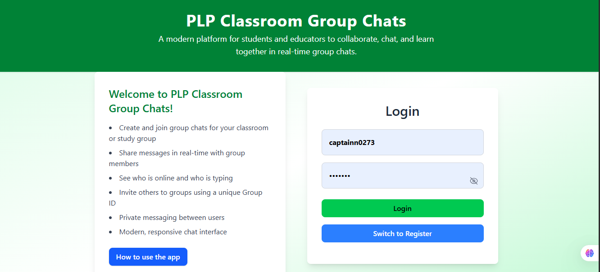
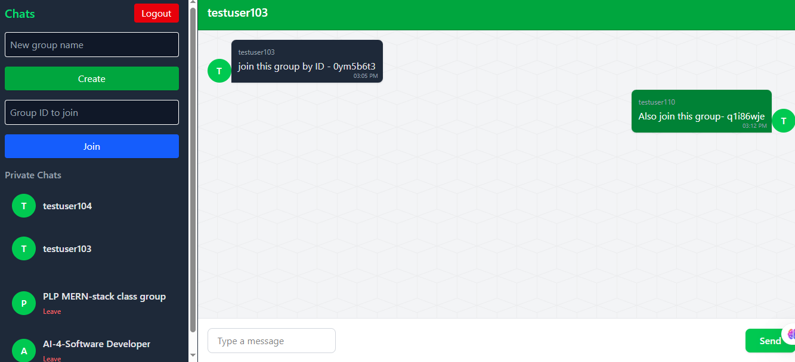

# PLP Classroom Group Chats

Welcome to **PLP Classroom Group Chats** – a modern, real-time chat platform designed for students and educators to collaborate, communicate, and learn together!

## Features
- Create and join group chats for your classroom or study group
- Share messages in real-time with group members
- See who is online and who is typing
- Invite others to groups using a unique Group ID
- Private messaging between users
- Modern, responsive chat interface

## Screenshots

### Home Page


### Group Chat Interface


## Installation

### Prerequisites
- Node.js (v18+ recommended)
- pnpm (or npm/yarn)
- MongoDB instance (local or Atlas)

### 1. Clone the Repository
```sh
git clone https://github.com/snjugunanjenga/PLP-Classroom-GroupChat.git
cd classroom-chat
```

### 2. Setup Environment Variables

#### **Backend (`server/.env`)**
```
JWT_SECRET=your_jwt_secret
MONGODB_URI=mongodb://localhost:27017/classroom-chat
```

#### **Frontend (`client/.env`)**
```
VITE_API_URL=http://localhost:5000
```

### 3. Install Dependencies
```sh
cd server && pnpm install
cd ../client && pnpm install
```

### 4. Run Locally
**Backend:**
```sh
cd server
pnpm run dev
```
**Frontend:**
```sh
cd client
pnpm run dev
```

The backend will run on `http://localhost:5000` and the frontend on `http://localhost:5173` by default.

## Getting Started
1. **Register or login** to your account.
2. **Create a new group** or **join an existing group** using a Group ID.
3. **Share the Group ID** with classmates to invite them.
4. **Start chatting!** See who is online and typing in real-time.
5. **Switch between groups and private chats** using the chat list.

## Tutorials
- Click the "How to use the app" button on the login page for a step-by-step guide.
- For more detailed help, see the [Help](#help) section below.

## Footer Links

### Help
If you need assistance using PLP Classroom Group Chats:
- Click the "How to use the app" button on the login page for a quick tutorial.
- For technical issues, contact your class administrator or email support at `support@plpclassroom.com`.
- Common issues include: login problems, group joining errors, or connection issues. Try refreshing the page or checking your internet connection.

### About Us
PLP Classroom Group Chats is a project by the PLP community to foster better communication and collaboration among students and educators. Our mission is to make group learning interactive, accessible, and fun for everyone.

For more information, visit our website or reach out to us at `info@plpclassroom.com`.

---
## Author : Cpt N


## License
MIT &copy; {new Date().getFullYear()} PLP Classroom Group Chats. All rights reserved. 
